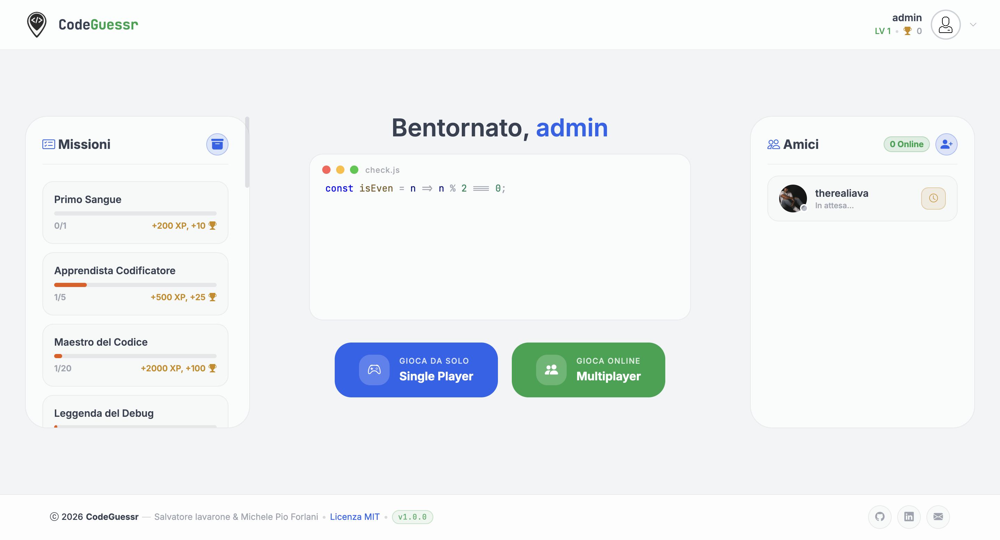
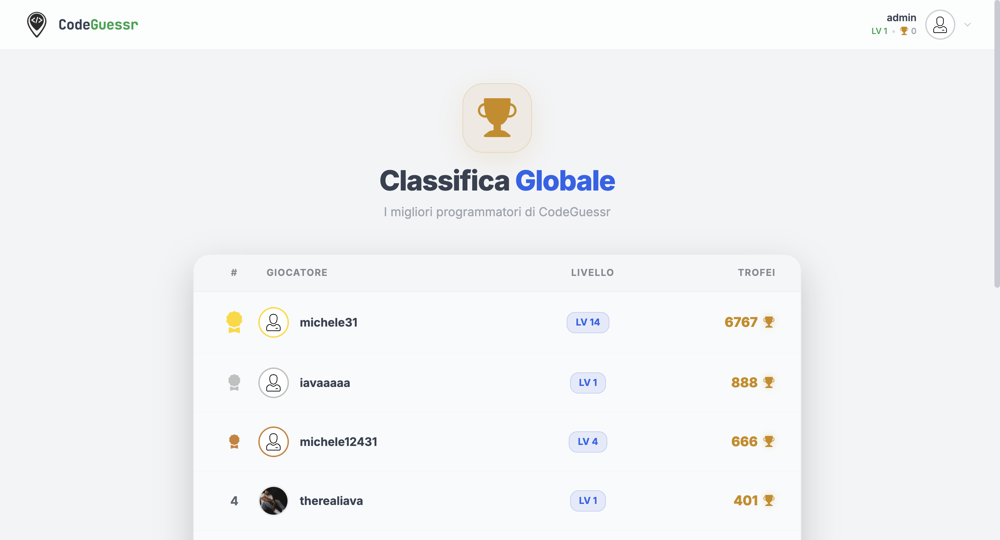
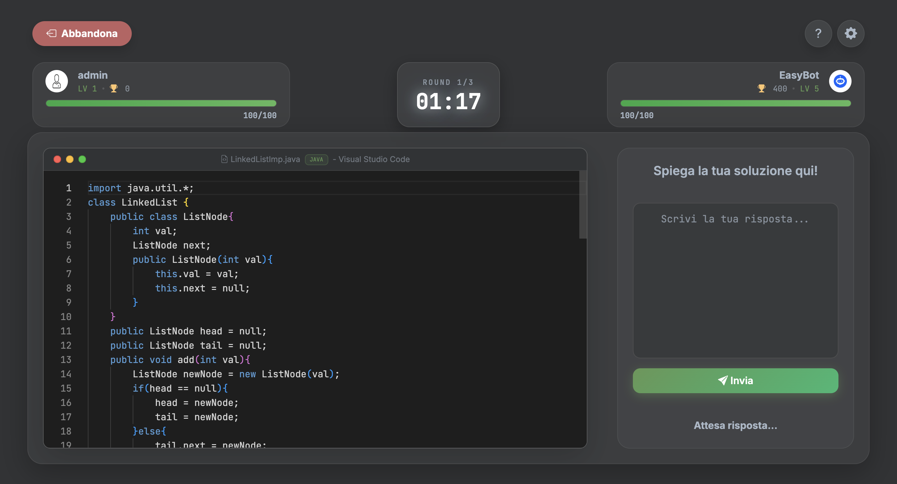
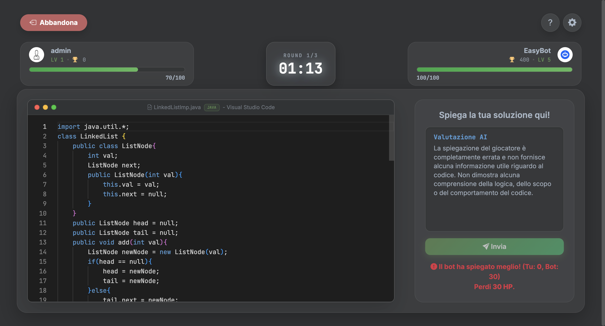
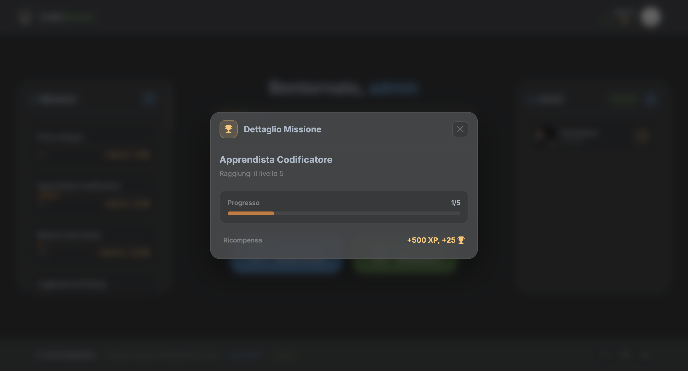
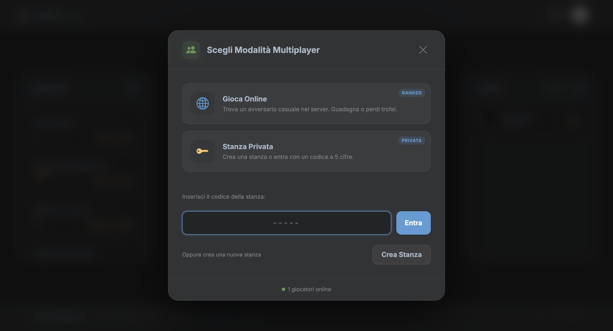
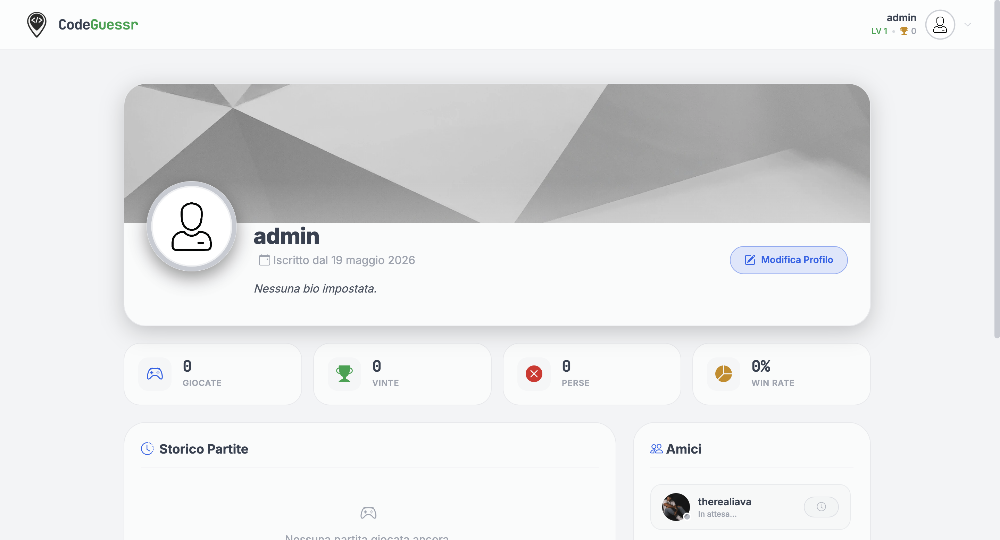
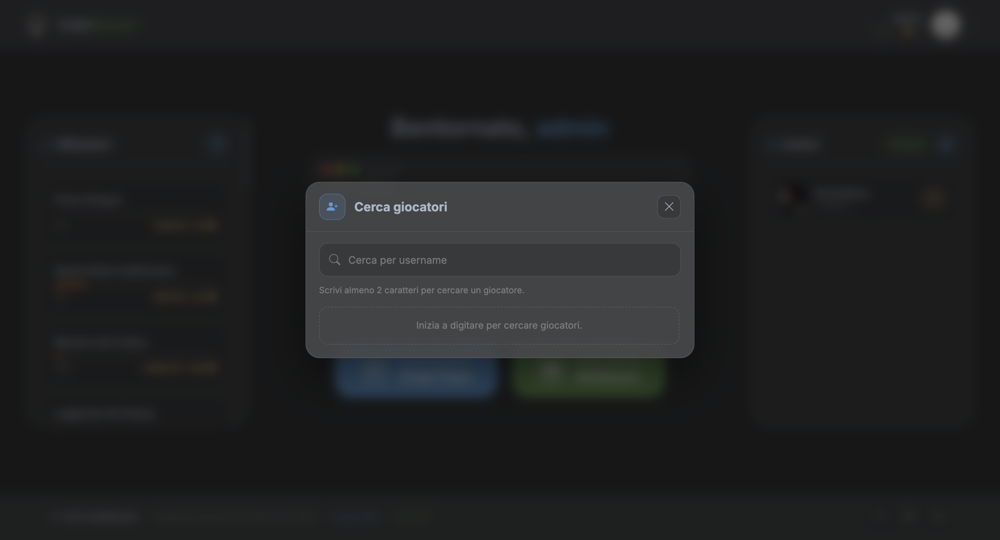
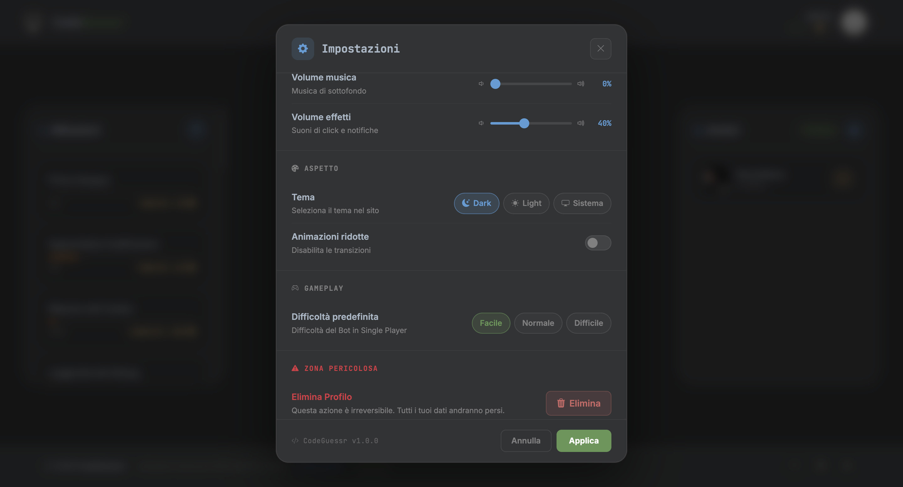

# Interfaccia Grafica e Galleria Schermate - CodeGuessr

Questo documento raccoglie e illustra l'interfaccia utente (**UI**) e l'esperienza d'uso (**UX**) di **CodeGuessr** attraverso gli screenshot delle varie schermate di gioco. Ogni sezione offre una spiegazione breve ma esaustiva della struttura tecnica e visiva implementata.

---

## Collegamenti Rapidi alla Documentazione
* **[Architettura Tecnica e Specifiche (ARCHITETTURA.md)](ARCHITETTURA.md)**
* **[README Principale del Progetto (../README.md)](../README.md)**

---

## Galleria delle Schermate

### 1. Lobby Principale (`game_page.png`)

* **Descrizione:** La schermata di ingresso principale (Home/Lobby) del giocatore autenticato. 
* **Caratteristiche Salienti:**
  * **Progressione XP:** Visualizzazione dinamica del livello e del progresso XP tramite un anello grafico circolare personalizzato.
  * **Lista Amici:** Pannello laterale destro sincronizzato in tempo reale (via WebSocket) per visualizzare lo stato degli amici (Online/Offline) e consentire sfide dirette.
  * **Pannello Missioni:** Elenco delle missioni quotidiane attive con le rispettive ricompense in punti esperienza e coppe.
  * **Matchmaking:** Pulsante principale dal design premium per avviare la ricerca automatica degli avversari o configurare sfide private.

---

### 2. Classifica Globale (`leaderboard_page.png`)

* **Descrizione:** La schermata competitiva in cui vengono mostrati i migliori programmatori del server in base alle coppe/trofei accumulati.
* **Caratteristiche Salienti:**
  * **Podio Evidenziato:** I primi tre classificati sono contrassegnati con badge grafici esclusivi (Oro, Argento, Bronzo).
  * **Raffinatezza Estetica:** Tabella con effetto vetro (Glassmorphism) e righe evidenziate al passaggio del mouse (hover micro-animations).
  * **Informazioni Dettagliate:** Mostra nickname, livello attuale, XP e punteggio trofei per ogni sviluppatore.

---

### 3. Schermata di Match - Fase di Gioco (`match_page.png`)

* **Descrizione:** L'arena principale del match (in modalità Single Player o Multiplayer real-time) in cui l'utente deve analizzare lo snippet.
* **Caratteristiche Salienti:**
  * **Monaco Editor Integrato:** Visualizzazione ad alta leggibilità dello snippet di codice (recuperato in tempo reale da GitHub o da fallback locale).
  * **Barre della Salute (HP):** Indicatori in alto per tracciare lo stato di salute dei due contendenti (o del bot).
  * **Campo di Input delle Spiegazioni:** Un'area di testo spaziosa in cui inserire la propria spiegazione tecnica dell'algoritmo e della complessità computazionale in linguaggio naturale.

---

### 4. Valutazione Dettagliata dell'AI (`match_page_ai_evaluation.png`)

* **Descrizione:** La schermata di match durante la fase di feedback della spiegazione, in cui compare la valutazione fornita dal LLM.
* **Caratteristiche Salienti:**
  * **Sostituzione Responsiva:** La casella di testo per l'inserimento dell'input si contrae lasciando il posto al box di valutazione dell'AI (`.cg-ai-evaluation-box`), garantendo una responsività ottimale senza alterare le altezze del layout.
  * **Feedback Motivato:** Mostra il punteggio numerico (0-100) e la spiegazione testuale concisa fornita dall'Intelligenza Artificiale che illustra i punti di forza o le lacune dell'analisi inviata.

---

### 5. Schermata Dettagliata Missioni (`missions_detailed.png`)

* **Descrizione:** Vista modale avanzata per consultare l'elenco completo degli obiettivi e dei traguardi sbloccabili all'interno del gioco.
* **Caratteristiche Salienti:**
  * **Card delle Missioni:** Ogni missione presenta un'icona tematica, una descrizione chiara dei requisiti e il dettaglio dei premi (XP e Trofei).
  * **Stato di Avanzamento:** Tracciamento grafico dei progressi compiuti ed evidenziazione dei traguardi già sbloccati ed incassati.

---

### 6. Impostazioni Multiplayer e Stanza Privata (`multiplayer_settings.png`)

* **Descrizione:** L'overlay di impostazione della modalità multigiocatore per sfidare direttamente gli amici o unirsi a stanze personalizzate.
* **Caratteristiche Salienti:**
  * **Codici Stanza Unici:** Generazione e condivisione di chiavi alfanumeriche per creare ed accedere a lobby private.
  * **Selettore di Difficoltà:** Scelta del livello di sfida per la partita.
  * **Matchmaking Libero:** Sezione dedicata all'avvio rapido di partite competitive classificate.

---

### 7. Profilo Sviluppatore (`profile_page.png`)

* **Descrizione:** La scheda personale del programmatore, ricca di dati statistici calcolati on-the-fly tramite viste aggregate sicure.
* **Caratteristiche Salienti:**
  * **Statistiche Generali:** Grafico visivo e riepilogo di partite giocate, vinte, perse e percentuale complessiva di Win Rate.
  * **Storico Partite:** Lista cronologica scorrevole dei match passati con dettagli sul risultato (vittoria/sconfitta), modalità di gioco, avversario e variazioni di XP e trofei.
  * **Network Sociale:** Widget della lista amici per monitorare le proprie amicizie e le richieste in sospeso direttamente dal profilo.

---

### 8. Ricerca Sviluppatori (`search_player.png`)

* **Descrizione:** Pannello modale di ricerca utenti per espandere la propria lista di amicizie all'interno del gioco.
* **Caratteristiche Salienti:**
  * **Ricerca Istantanea:** Input con filtro in tempo reale per nickname.
  * **Azioni Dirette:** Pulsanti dedicati per l'invio rapido di richieste di amicizia ad altri programmatori registrati sulla piattaforma.

---

### 9. Pannello Accessibilità e Preferenze (`settings_page.png`)

* **Descrizione:** Il pannello di configurazione del gioco incentrato sull'accessibilità visiva ed acustica.
* **Caratteristiche Salienti:**
  * **Slider Volume:** Controllo fine e indipendente dei volumi per gli effetti sonori (SFX) e la musica di sottofondo (BGM).
  * **Tema Dinamico:** Semplice interruttore per alternare istantaneamente tra tema Dark e tema Light.
  * **Riduzione Animazioni:** Funzionalità dedicata agli utenti sensibili per azzerare gli effetti di transizione CSS.

---

## 🔗 Collegamenti Rapidi alla Documentazione
* 📜 **[Architettura Tecnica e Specifiche (ARCHITETTURA.md)](ARCHITETTURA.md)**
* 💻 **[README Principale del Progetto (../README.md)](../README.md)**