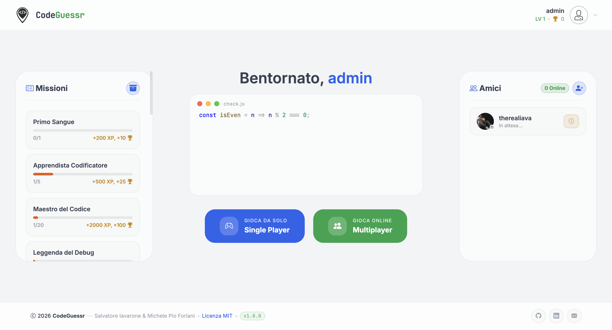
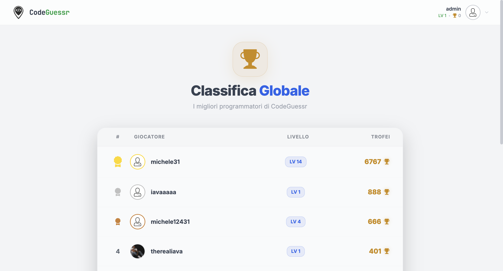
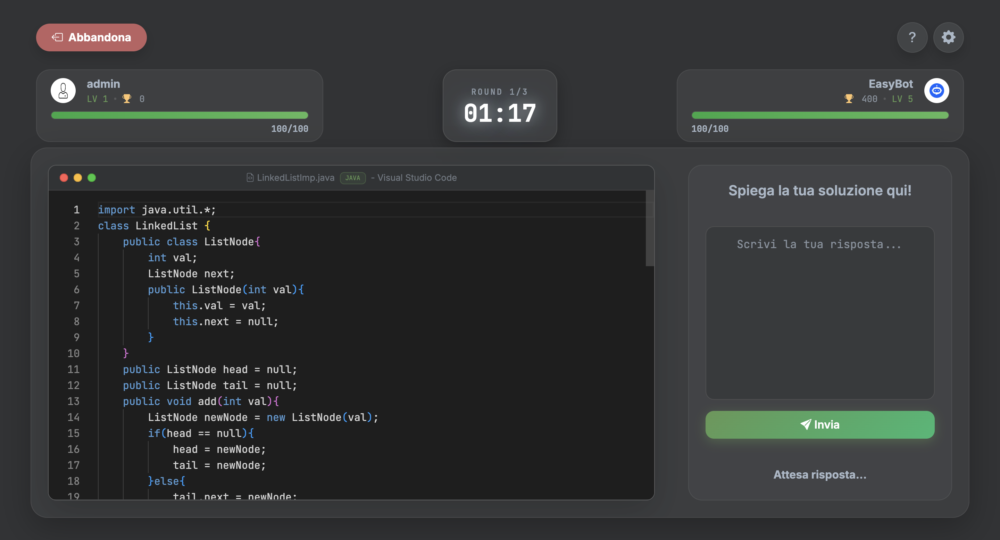
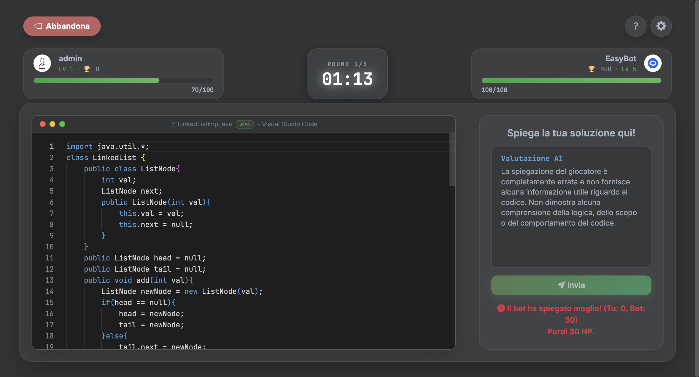
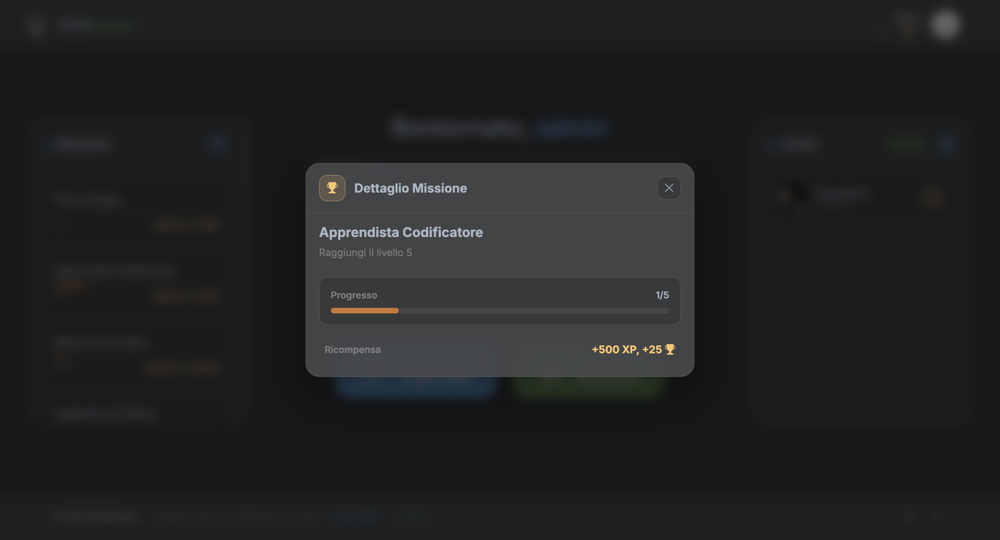
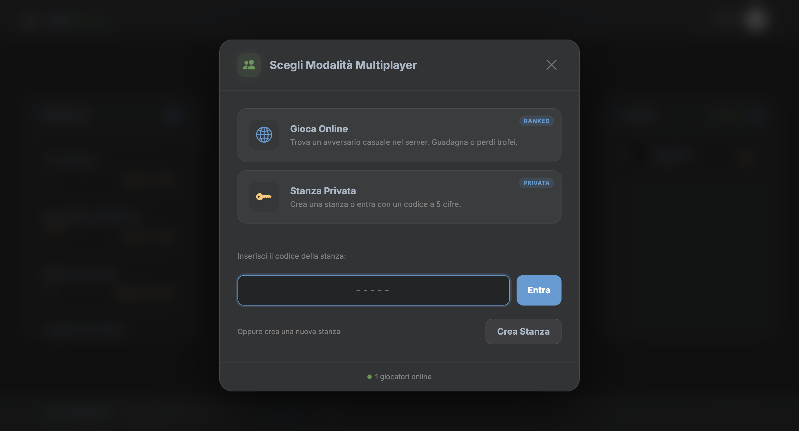
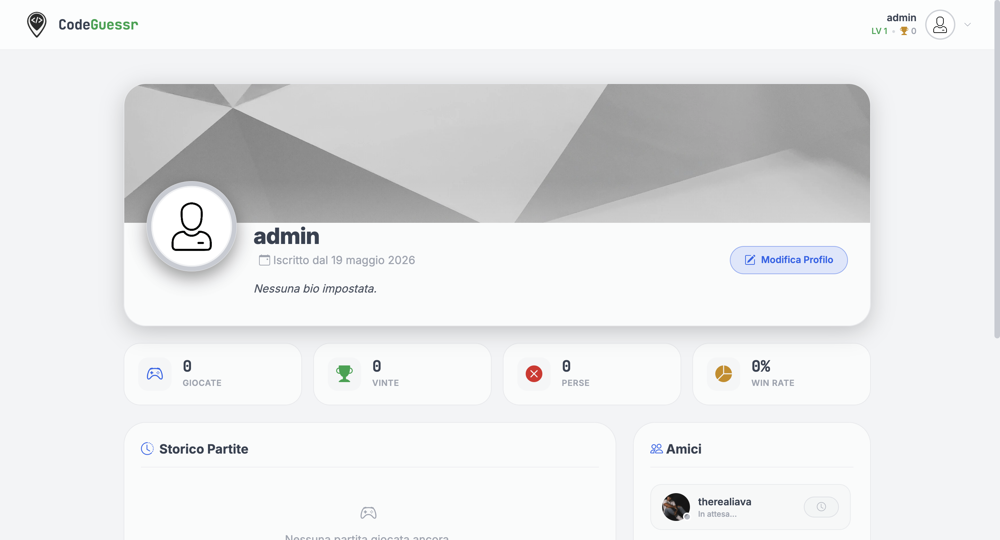
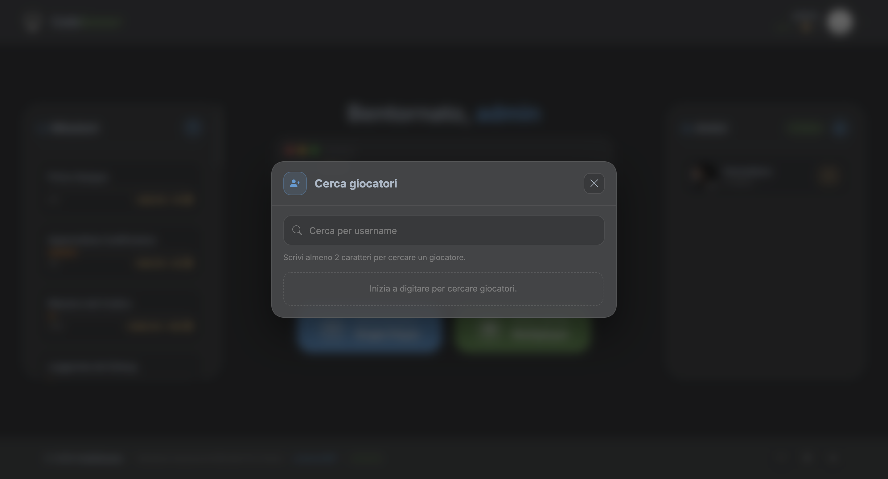
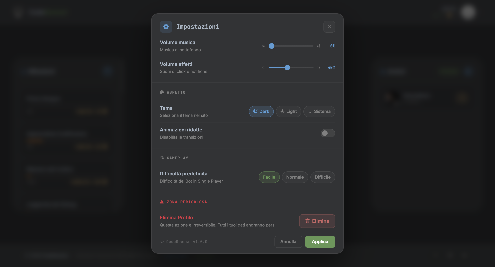

# Graphical Interface and Screenshot Gallery - CodeGuessr

This document collects and illustrates the **User Interface (UI)** and **User Experience (UX)** of **CodeGuessr** through screenshots of the various game screens. Each section provides a brief yet comprehensive explanation of the implemented technical and visual structure.

---

## Quick Links to Documentation

* **[Technical Architecture and Specifications (ARCHITECTURE.md)](ARCHITECTURE.md)**
* **[Main Project README (../README.md)](../README.md)**

---

## Screenshot Gallery

### 1. Main Lobby (`game_page.png`)

* **Description:** The main entry screen (Home/Lobby) for the authenticated player.
* **Key Features:**

  * **XP Progression:** Dynamic display of level and XP progress through a custom circular progress ring.
  * **Friends List:** Right-side panel synchronized in real time (via WebSocket) to display friends' status (Online/Offline) and enable direct challenges.
  * **Missions Panel:** List of active daily missions with their respective rewards in experience points and trophies.
  * **Matchmaking:** Main premium-styled button to start automatic opponent matchmaking or configure private matches.

---

### 2. Global Leaderboard (`leaderboard_page.png`)

* **Description:** The competitive screen displaying the server's top programmers based on accumulated trophies/cups.
* **Key Features:**

  * **Highlighted Podium:** The top three players are marked with exclusive graphical badges (Gold, Silver, Bronze).
  * **Aesthetic Refinement:** Glassmorphism-styled table with row highlights on hover (micro-animations).
  * **Detailed Information:** Displays nickname, current level, XP, and trophy score for each developer.

---

### 3. Match Screen - Gameplay Phase (`match_page.png`)

* **Description:** The main match arena (in Single Player or real-time Multiplayer mode), where the user analyzes the code snippet.
* **Key Features:**

  * **Integrated Monaco Editor:** High-readability display of the code snippet (retrieved in real time from GitHub or from a local fallback).
  * **Health Bars (HP):** Indicators at the top to track the health status of both players (or the bot).
  * **Explanation Input Field:** A spacious text area where users can submit a technical explanation of the algorithm and its computational complexity in natural language.

---

### 4. Detailed AI Evaluation (`match_page_ai_evaluation.png`)

* **Description:** The match screen during the explanation feedback phase, where the evaluation provided by the LLM is displayed.
* **Key Features:**

  * **Responsive Replacement:** The text input box contracts to make room for the AI evaluation box (`.cg-ai-evaluation-box`), ensuring optimal responsiveness without affecting layout height.
  * **Motivated Feedback:** Displays the numerical score (0–100) and a concise textual explanation provided by the Artificial Intelligence, highlighting strengths or weaknesses in the submitted analysis.

---

### 5. Detailed Missions Screen (`missions_detailed.png`)

* **Description:** Advanced modal view for consulting the complete list of unlockable objectives and milestones within the game.
* **Key Features:**

  * **Mission Cards:** Each mission includes a thematic icon, a clear requirement description, and reward details (XP and Trophies).
  * **Progress Tracking:** Visual tracking of achieved progress with highlights for unlocked and already claimed milestones.

---

### 6. Multiplayer Settings and Private Room (`multiplayer_settings.png`)

* **Description:** Multiplayer mode configuration overlay for directly challenging friends or joining custom rooms.
* **Key Features:**

  * **Unique Room Codes:** Generation and sharing of alphanumeric keys to create and access private lobbies.
  * **Difficulty Selector:** Choice of challenge level for the match.
  * **Open Matchmaking:** Dedicated section for quickly launching ranked competitive matches.

---

### 7. Developer Profile (`profile_page.png`)

* **Description:** The programmer’s personal profile page, rich with statistical data calculated on-the-fly through secure aggregated views.
* **Key Features:**

  * **General Statistics:** Visual chart and summary of matches played, won, lost, and overall win rate percentage.
  * **Match History:** Scrollable chronological list of previous matches, including result (win/loss), game mode, opponent, and XP/trophy changes.
  * **Social Network:** Friends list widget to manage friendships and monitor pending friend requests directly from the profile.

---

### 8. Developer Search (`search_player.png`)

* **Description:** Modal user search panel for expanding the in-game friends list.
* **Key Features:**

  * **Instant Search:** Real-time nickname filtering input.
  * **Direct Actions:** Dedicated buttons for quickly sending friend requests to other registered programmers on the platform.

---

### 9. Accessibility and Preferences Panel (`settings_page.png`)

* **Description:** The game settings panel focused on visual and audio accessibility.
* **Key Features:**

  * **Volume Sliders:** Fine-grained and independent control for sound effects (SFX) and background music (BGM) volumes.
  * **Dynamic Theme:** Simple toggle to instantly switch between Dark and Light themes.
  * **Reduced Animations:** Dedicated functionality for users sensitive to motion, allowing CSS transition effects to be disabled.

---

## Quick Links to Documentation

* **[Technical Architecture and Specifications (ARCHITECTURE.md)](ARCHITECTURE.md)**
* **[Main Project README (../README.md)](../README.md)**